# Statistical Analysis of Network Data
Gábor Csárdi  
`r Sys.Date()`  


## How to follow this tutorial

Go to https://github.com/igraph/netuser15

You will need at least `igraph` version `1.0.0` and `igraphdata` version
`1.0.0`. You will also need the `DiagrammeR` package. To install them
from within R, type:

```r
install.packages("igraph")
install.packages("igraphdata")
install.packages("DiagrammeR")
```


## Outline

* Introduction
* Manipulate network data
* Questions

### BREAK

* Classic graph theory: paths
* Social network concepts: centrality, groups
* Visualization
* Questions

## Why networks?

Sometimes connections are important, even more important than
(the properties of) the things they connect.

## Example 1: Königsberg Bridges

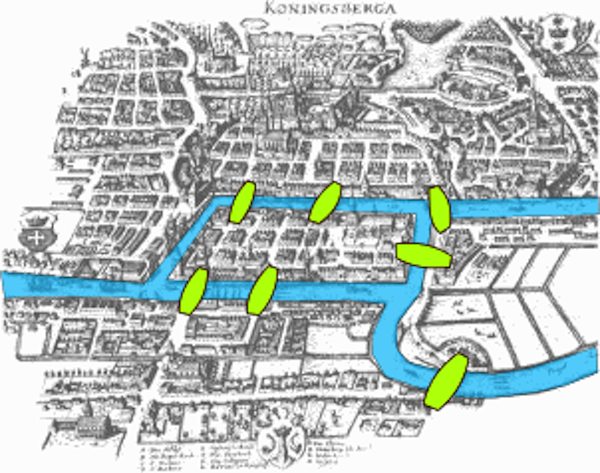

-- Bogdan Giuşcă, CC BY-SA 3.0, Wikipedia

## Example 2: Page Rank


http://computationalculture.net/article/what_is_in_pagerank

## Example 3: Matching Twitter to Facebook


http://morganlinton.com/wp-content/uploads/2013/12/twitter-facebook-branding2.png

## Example 4: Detection of groups 

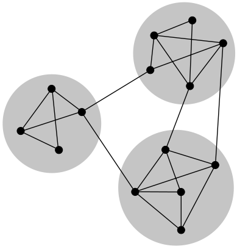

https://en.wikipedia.org/wiki/Community_structure#/
media/File:Network_Community_Structure.svg

<!-- ## Example 5: Detection of unusual activity -->

<!-- Detection of dense parts of the network, that were not dense before. -->

## About igraph

* Network analysis library, written mostly in C/C++.
* Interface to R and Python
* https://github.com/igraph
* http://igraph.org
* Mailing list, stack overflow help.
* Open GitHub issues for bugs

# Creating and manipulating networks in R/igraph.

## What is a network or graph?

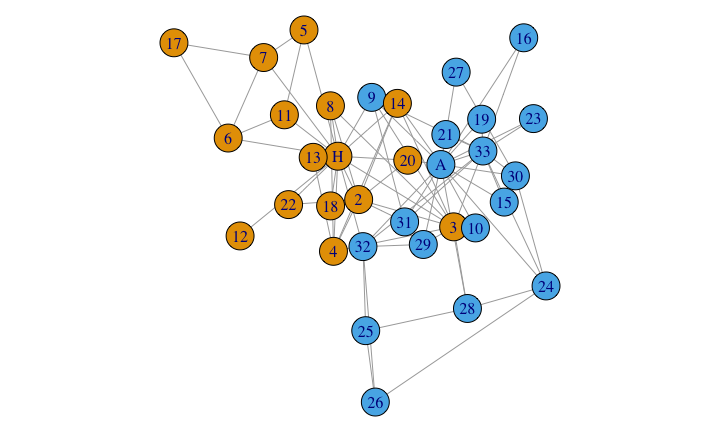 

## More formally:

* `V`: set of vertices
* `E`: subset of ordered or unordered pairs of vertices. Multiset, really.

## Creating toy networks with `make_graph`


```r
library(igraph)
```


```r
toy1 <- make_graph(~ A - B, B - C - D, D - E:F:A, A:B - G:H)
toy1
```

```
#> IGRAPH UN-- 8 10 -- 
#> + attr: name (v/c)
#> + edges (vertex names):
#>  [1] A--B A--D A--G A--H B--C B--G B--H C--D D--E D--F
```

----


```r
par(mar = c(0,0,0,0)); plot(toy1)
```

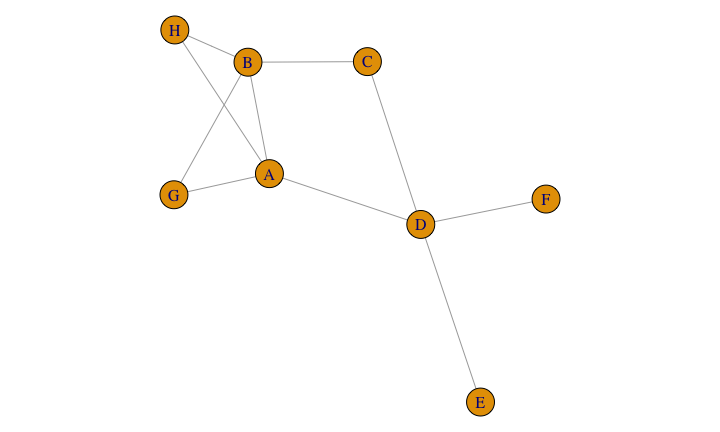 

----


```r
toy2 <- make_graph(~ A -+ B, B -+ C -+ D +- A:B)
toy2
```

```
#> IGRAPH DN-- 4 5 -- 
#> + attr: name (v/c)
#> + edges (vertex names):
#> [1] A->B A->D B->C B->D C->D
```

----


```r
par(mar = c(0,0,0,0)); plot(toy2)
```

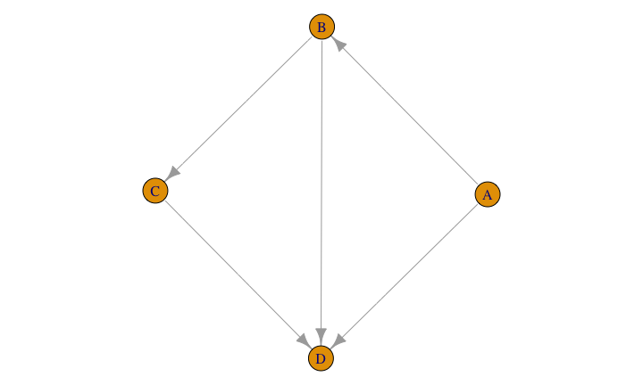 

## Printout of a graph


```r
toy2
```

```
#> IGRAPH DN-- 4 5 -- 
#> + attr: name (v/c)
#> + edges (vertex names):
#> [1] A->B A->D B->C B->D C->D
```

`IGRAPH` means this is a graph object. Next, comes a four letter
code:

* `U` or `D` for undirected or directed
* `N` if the graph is named, always use named graphs for real data sets.
* `W` if the graph is weighted (has a `weight` edge attribute).
* `B` if the graph is bipartite (has a `type` vertex attribute).

## Attributes


```r
make_ring(5)
```

```
#> IGRAPH U--- 5 5 -- Ring graph
#> + attr: name (g/c), mutual (g/l), circular (g/l)
#> + edges:
#> [1] 1--2 2--3 3--4 4--5 1--5
```

* Some graphs have a name (`name` graph attribute), that comes after
the two dashes.
* Then the variuos attributes are listed. Attributes
are metadata that is attached to the vertices, edges, or the graph
itself.
* `(v/c)` means that `name` is a vertex attribute, and it is
character.
* `(e/.)` means an edge attribute, `(g/.)` means a graph attribute

-----


```r
make_ring(5)
```

```
#> IGRAPH U--- 5 5 -- Ring graph
#> + attr: name (g/c), mutual (g/l), circular (g/l)
#> + edges:
#> [1] 1--2 2--3 3--4 4--5 1--5
```
* Attribute types: `c` for character, `n` for numeric, `l` for
logical and `x` (complex) for anything else.
* igraph treats some attributes specially. Always start your non-special
attributes with an uppercase letter.

## Real network data

## Adjacency matrices


```r
A <- matrix(sample(0:1, 100, replace = TRUE), nrow = 10)
A
```

```
#>       [,1] [,2] [,3] [,4] [,5] [,6] [,7] [,8] [,9] [,10]
#>  [1,]    0    0    1    0    0    0    0    1    1     1
#>  [2,]    1    1    0    1    0    0    0    1    1     1
#>  [3,]    0    1    0    1    0    1    1    0    1     1
#>  [4,]    0    0    0    0    1    1    0    0    0     0
#>  [5,]    0    1    0    0    0    1    1    0    0     0
#>  [6,]    1    0    1    1    1    0    0    0    0     1
#>  [7,]    1    1    0    0    0    0    1    0    0     0
#>  [8,]    1    0    1    1    0    0    1    0    0     0
#>  [9,]    1    1    1    1    0    0    0    0    1     1
#> [10,]    1    1    1    1    1    0    0    1    1     1
```

-----


```r
graph_from_adjacency_matrix(A)
```

```
#> IGRAPH D--- 10 47 -- 
#> + edges:
#>  [1]  1-> 3  1-> 8  1-> 9  1->10  2-> 1  2-> 2  2-> 4  2-> 8  2-> 9
#> [10]  2->10  3-> 2  3-> 4  3-> 6  3-> 7  3-> 9  3->10  4-> 5  4-> 6
#> [19]  5-> 2  5-> 6  5-> 7  6-> 1  6-> 3  6-> 4  6-> 5  6->10  7-> 1
#> [28]  7-> 2  7-> 7  8-> 1  8-> 3  8-> 4  8-> 7  9-> 1  9-> 2  9-> 3
#> [37]  9-> 4  9-> 9  9->10 10-> 1 10-> 2 10-> 3 10-> 4 10-> 5 10-> 8
#> [46] 10-> 9 10->10
```

## List of edges


```r
L <- matrix(sample(1:10, 20, replace = TRUE), ncol = 2)
L
```

```
#>       [,1] [,2]
#>  [1,]    7    6
#>  [2,]    6    4
#>  [3,]    4    1
#>  [4,]    7    6
#>  [5,]    7    4
#>  [6,]    6    7
#>  [7,]    5   10
#>  [8,]   10    9
#>  [9,]    4    7
#> [10,]    2    2
```

-----


```r
graph_from_edgelist(L)
```

```
#> IGRAPH D--- 10 10 -- 
#> + edges:
#>  [1]  7-> 6  6-> 4  4-> 1  7-> 6  7-> 4  6-> 7  5->10 10-> 9  4-> 7
#> [10]  2-> 2
```

## Two tables, one for vertices, one for edges


```r
edges <- data.frame(
  stringsAsFactors = FALSE,
  from = c("BOS", "JFK", "LAX"),
  to   = c("JFK", "LAX", "JFK"),
  Carrier = c("United", "Jetblue", "Virgin America"),
  Departures = c(30, 60, 121)
)
vertices <- data.frame(
  stringsAsFactors = FALSE,
  name = c("BOS", "JFK", "LAX"),
  City = c("Boston, MA", "New York City, NY",
    "Los Angeles, CA")
)
```

-----


```r
edges
```

```
#>   from  to        Carrier Departures
#> 1  BOS JFK         United         30
#> 2  JFK LAX        Jetblue         60
#> 3  LAX JFK Virgin America        121
```

-----


```r
vertices
```

```
#>   name              City
#> 1  BOS        Boston, MA
#> 2  JFK New York City, NY
#> 3  LAX   Los Angeles, CA
```

-----


```r
toy_air <- graph_from_data_frame(edges, vertices = vertices)
toy_air
```

```
#> IGRAPH DN-- 3 3 -- 
#> + attr: name (v/c), City (v/c), Carrier (e/c), Departures (e/n)
#> + edges (vertex names):
#> [1] BOS->JFK JFK->LAX LAX->JFK
```

----

The real US airports data set is in the `igraphdata` package:


```r
library(igraphdata)
data(USairports)
USairports
```

```
#> IGRAPH DN-- 755 23473 -- US airports
#> + attr: name (g/c), name (v/c), City (v/c), Position (v/c),
#> | Carrier (e/c), Departures (e/n), Seats (e/n), Passengers
#> | (e/n), Aircraft (e/n), Distance (e/n)
#> + edges (vertex names):
#>  [1] BGR->JFK BGR->JFK BOS->EWR ANC->JFK JFK->ANC LAS->LAX MIA->JFK
#>  [8] EWR->ANC BJC->MIA MIA->BJC TEB->ANC JFK->LAX LAX->JFK LAX->SFO
#> [15] AEX->LAS BFI->SBA ELM->PIT GEG->SUN ICT->PBI LAS->LAX LAS->PBI
#> [22] LAS->SFO LAX->LAS PBI->AEX PBI->ICT PIT->VCT SFO->LAX VCT->DWH
#> [29] IAD->JFK ABE->CLT ABE->HPN AGS->CLT AGS->CLT AVL->CLT AVL->CLT
#> [36] AVP->CLT AVP->PHL BDL->CLT BHM->CLT BHM->CLT BNA->CLT BNA->CLT
#> + ... omitted several edges
```

----

Converting it back to tables


```r
as_data_frame(toy_air, what = "edges")
```

```
#>   from  to        Carrier Departures
#> 1  BOS JFK         United         30
#> 2  JFK LAX        Jetblue         60
#> 3  LAX JFK Virgin America        121
```

-----


```r
as_data_frame(toy_air, what = "vertices")
```

```
#>     name              City
#> BOS  BOS        Boston, MA
#> JFK  JFK New York City, NY
#> LAX  LAX   Los Angeles, CA
```

-----

Long data frames


```r
as_long_data_frame(toy_air)
```

```
#>   from to        Carrier Departures from_name         from_City to_name
#> 1    1  2         United         30       BOS        Boston, MA     JFK
#> 2    2  3        Jetblue         60       JFK New York City, NY     LAX
#> 3    3  2 Virgin America        121       LAX   Los Angeles, CA     JFK
#>             to_City
#> 1 New York City, NY
#> 2   Los Angeles, CA
#> 3 New York City, NY
```

-----

Quickly look at the metadata, without conversion:


```r
V(USairports)[[1:5]]
```

```
#> + 5/755 vertices, named:
#>   name          City         Position
#> 1  BGR    Bangor, ME N444827 W0684941
#> 2  BOS    Boston, MA N422152 W0710019
#> 3  ANC Anchorage, AK N611028 W1495947
#> 4  JFK  New York, NY N403823 W0734644
#> 5  LAS Las Vegas, NV N360449 W1150908
```

----


```r
E(USairports)[[1:5]]
```

```
#> + 5/23473 edges (vertex names):
#>   tail head tid hid             Carrier Departures Seats Passengers
#> 1  JFK  BGR   4   1 British Airways Plc          1   226        193
#> 2  JFK  BGR   4   1 British Airways Plc          1   299        253
#> 3  EWR  BOS   7   2 British Airways Plc          1   216        141
#> 4  JFK  ANC   4   3 China Airlines Ltd.         13  5161       3135
#> 5  ANC  JFK   3   4 China Airlines Ltd.         13  5161       4097
#>   Aircraft Distance
#> 1      627      382
#> 2      819      382
#> 3      627      200
#> 4      819     3386
#> 5      819     3386
```

## Weighted graphs

Numbers (usually real) assigned to edges. E.g. number of departures,
or number of passengers.


http://web.cecs.pdx.edu/~sheard/course/Cs163/Doc/Graphs.html

## Multigraphs

They have multiple (directed) edges between the
same pair of vertices. A graph that has no multiple edges
and no loop edges is a simple graph.

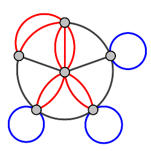

https://en.wikipedia.org/wiki/Multigraph

Multi-graphs are nasty. Always check if your graph is a multi-graph.

-----


```r
is_simple(USairports)
```

```
#> [1] FALSE
```

```r
sum(which_multiple(USairports))
```

```
#> [1] 15208
```

```r
sum(which_loop(USairports))
```

```
#> [1] 53
```

-----

`simplify()` creates a simple graph from a multigraph, in a flexible
way: you can specify what it should do with the edge attributes.


```r
air <- simplify(USairports, edge.attr.comb =
  list(Departures = "sum", Seats = "sum", Passengers = "sum", "ignore"))
is_simple(air)
```

```
#> [1] TRUE
```

```r
summary(air)
```

```
#> IGRAPH DN-- 755 8228 -- US airports
#> + attr: name (g/c), name (v/c), City (v/c), Position (v/c),
#> | Departures (e/n), Seats (e/n), Passengers (e/n)
```

## Querying and manipulating networks: the `[` and `[[` operators

The `[` operator treats the graph as an adjacency matrix.

```
    BOS JFK ANC EWR . . .
BOS   .   1   .   1
JFK   1   .   1   .
ANC   .   1   .   .
EWR   1   .   1   .
. . .
```
-----

The `[[` operator treats the graph as an adjacency list.


```r
BOS: JFK, LAX, EWR, MKE, PVD
JFK: BGR, BOS, SFO, BNA, BUF, SRQ, RIC RDU, MSP
LAX: DTW, MSY, LAS, FLL, STL,
. . .
```

## Queries

Does an edge exist?


```r
air["BOS", "JFK"]
```

```
#> [1] 1
```

```r
air["BOS", "ANC"]
```

```
#> [1] 0
```

-----

Convert the graph to an adjacency matrix, or just a part of it:


```r
air[c("BOS", "JFK", "ANC"), c("BOS", "JFK", "ANC")]
```

```
#> 3 x 3 sparse Matrix of class "dgCMatrix"
#>     BOS JFK ANC
#> BOS   .   1   .
#> JFK   1   .   1
#> ANC   .   1   .
```

For weighted graphs, query the edge weight:


```r
E(air)$weight <- E(air)$Passengers
air["BOS", "JFK"]
```

```
#> [1] 31426
```

----

All adjacenct vertices of a vertex:


```r
air[["BOS"]]
```

```
#> $BOS
#> + 79/755 vertices, named:
#>  [1] BGR JFK LAS MIA EWR LAX PBI PIT SFO IAD BDL BUF BWI CAK CLE CLT CMH
#> [18] CVG DCA DTW GSO IND LGA MDT MKE MSP MSY MYR ORF PHF PHL RDU RIC SRQ
#> [35] STL SYR ALB PVD ROC SCE FLL MCO TPA BHB IAH ORD PBG PQI MCI ATL AUS
#> [52] DEN DFW MDW PDX PHX RSW SAN SEA SLC ACY JAX MEM SJU STT SJC LGB FRG
#> [69] IAG ACK LEB MVY PVC BMG AUG HYA RKD RUT SLK
```

----


```r
air[[, "BOS"]]
```

```
#> $BOS
#> + 79/755 vertices, named:
#>  [1] BGR JFK LAS MIA EWR LAX PBI PIT SFO IAD BDL BUF BWI CAK CLE CLT CMH
#> [18] CVG DCA DTW IND LGA MDT MKE MSP MSY MYR PHF PHL RDU RIC SRQ STL SYR
#> [35] XNA ALB MHT PVD ROC SCE FLL MCO TPA BHB IAH ORD PBG PQI MCI ATL AUS
#> [52] DEN DFW MDW PDX PHX RSW SAN SEA SLC ACY JAX MEM SJU STT SJC LGB FRG
#> [69] PTK PGD ACK LEB MVY PVC AUG HYA RKD RUT SLK
```

## Manipulation

Add an edge (and potentially set its weight):

```r
air["BOS", "ANC"] <- TRUE
air["BOS", "ANC"]
```

```
#> [1] 1
```

Remove an edge:

```r
air["BOS", "ANC"] <- FALSE
air["BOS", "ANC"]
```

```
#> [1] 0
```

----

Note that you can use all allowed indexing modes, e.g.

```r
g <- make_empty_graph(10)
g[-1, 1] <- TRUE
g
```

```
#> IGRAPH D--- 10 9 -- 
#> + edges:
#> [1]  2->1  3->1  4->1  5->1  6->1  7->1  8->1  9->1 10->1
```
creates a star graph.

----

Add vertices to a graph:


```r
g <- make_ring(10) + 2
par(mar = c(0,0,0,0)); plot(g)
```

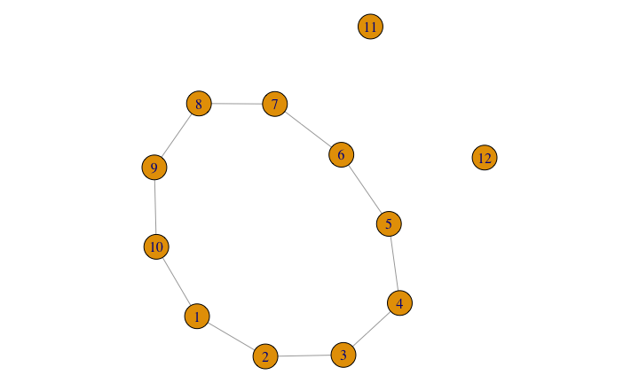 

----

Add vertices with attributes:


```r
g <- make_(ring(10), with_vertex_(color = "grey")) +
  vertices(2, color = "red")
par(mar = c(0,0,0,0)); plot(g)
```

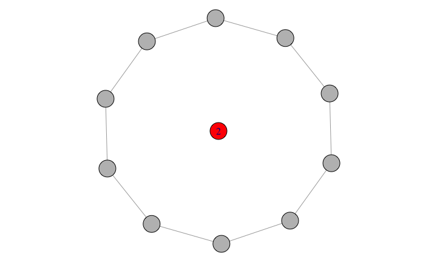 

----

Add an edge


```r
g <- make_(star(10), with_edge_(color = "grey")) +
  edge(5, 6, color = "red")
par(mar = c(0,0,0,0)); plot(g)
```

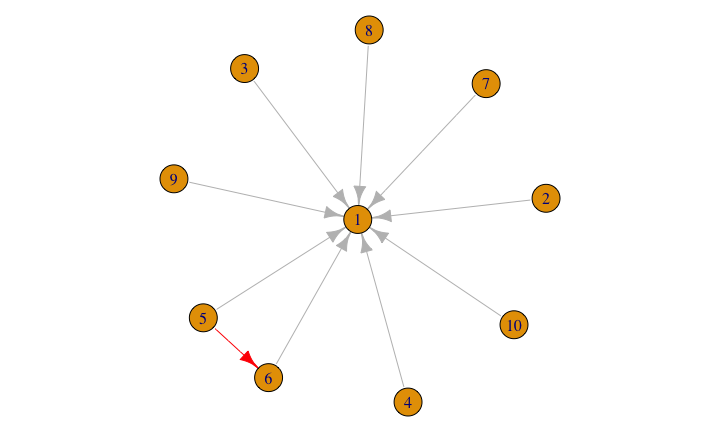 

----

Add a chain of edges


```r
g <- make_(empty_graph(5)) + path(1,2,3,4,5,1)
g2 <- make_(empty_graph(5)) + path(1:5, 1)
g
```

```
#> IGRAPH D--- 5 5 -- 
#> + edges:
#> [1] 1->2 2->3 3->4 4->5 5->1
```

```r
g2
```

```
#> IGRAPH D--- 5 5 -- 
#> + edges:
#> [1] 1->2 2->3 3->4 4->5 5->1
```

## Exercise

Create the wheel graph.

 

## (A) solution


```r
make_star(11, center = 11, mode = "undirected") + path(1:10, 1)
```

```
#> IGRAPH U--- 11 20 -- Star
#> + attr: name (g/c), mode (g/c), center (g/n)
#> + edges:
#>  [1]  1--11  2--11  3--11  4--11  5--11  6--11  7--11  8--11  9--11
#> [10] 10--11  1-- 2  2-- 3  3-- 4  4-- 5  5-- 6  6-- 7  7-- 8  8-- 9
#> [19]  9--10  1--10
```

## Vertex sequences

They are the key objects to manipulate graphs. Vertex sequences
can be created in various ways. Most frequently used ones:

|expression                 |result                            |
|:--------------------------|:---------------------------------|
|`V(air)`                   |All vertices.                     |
|`V(air)[1,2:5]`            |Vertices in these positions       |
|`V(air)[degree(air) < 2]`  |Vertices satisfying condition     |
|`V(air)[nei('BOS')]`       |Neighbors of a vertex             |
|`V(air)['BOS', 'JFK']`     |Select given vertices             |

## Edge sequences

The same for edges:

|expresssion                |result                                       |
|:--------------------------|:--------------------------------------------|
|`E(air)`                   |All edges.                                   |
|`E(air)[FL %--% CA]`       |Edges between two vertex sets                |
|`E(air)[FL %->% CA]`       |Edges between two vertex sets, directionally |
|`E(air, path = P)`         |Edges along a path                           |
|`E(air)[to('BOS')]`        |Incoming edges of a vertex                   |
|`E(air)[from('BOS')]`      |Outgoing edges of a vertex                   |

## Manipulate attributes via vertex and edge sequences


```r
FL <- V(air)[grepl("FL$", City)]
CA <- V(air)[grepl("CA$", City)]

V(air)$color <- "grey"
V(air)[FL]$color <- "blue"
V(air)[CA]$color <- "blue"
```

----


```r
E(air)[FL %--% CA]
```

```
#> + 21/8228 edges (vertex names):
#>  [1] MIA->LAX MIA->SFO MIA->SJC LAX->MIA LAX->FLL LAX->MCO LAX->TPA
#>  [8] SFO->MIA SFO->FLL SFO->MCO FLL->LAX FLL->SFO FLL->LGB MCO->LAX
#> [15] MCO->SFO TPA->LAX SMF->MIA JAX->OAK OAK->JAX LGB->FLL VNY->ORL
```

```r
E(air)$color <- "grey"
E(air)[FL %--% CA]$color <- "red"
```

## Quick look at metadata


```r
V(air)[[1:5]]
```

```
#> + 5/755 vertices, named:
#>   name          City         Position color
#> 1  BGR    Bangor, ME N444827 W0684941  grey
#> 2  BOS    Boston, MA N422152 W0710019  grey
#> 3  ANC Anchorage, AK N611028 W1495947  grey
#> 4  JFK  New York, NY N403823 W0734644  grey
#> 5  LAS Las Vegas, NV N360449 W1150908  grey
```

----


```r
E(air)[[1:5]]
```

```
#> + 5/8228 edges (vertex names):
#>   tail head tid hid Departures Seats Passengers weight color
#> 1  BOS  BGR   2   1          1    34          6      6  grey
#> 2  JFK  BGR   4   1          2   525        446    446  grey
#> 3  MIA  BGR   6   1          1    12          4      4  grey
#> 4  EWR  BGR   7   1          4   758        680    680  grey
#> 5  DCA  BGR  43   1          4   200        116    116  grey
```

# BREAK

## Paths


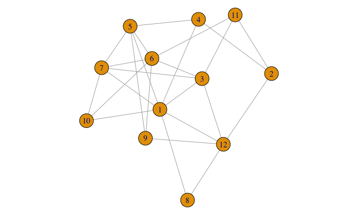 

## Paths

 

## Define a path in igraph


```r
set.seed(42)
g <- sample_gnp(12, 0.25)

pa <- V(g)[11, 2, 12, 8]

V(g)[pa]$color <- 'green'
E(g)$color <- 'grey'
E(g, path = pa)$color <- 'red'
E(g, path = pa)$width <- 3
```

----


```r
par(mar=c(0,0,0,0))
plot(g, margin = 0, layout = layout_nicely)
```

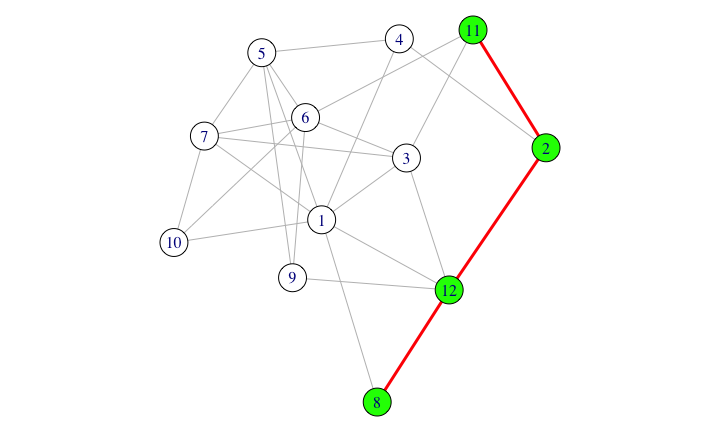 

## Shortest paths

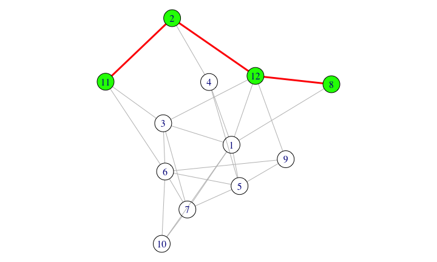 

----

Length of the shortest path: distance.
How many planes to get from `PBI` to `BDL`?


```r
air <- delete_edge_attr(air, "weight")
distances(air, 'PBI', 'ANC')
```

```
#>     ANC
#> PBI   2
```

----


```r
sp <- shortest_paths(air, 'PBI', 'ANC', output = "both")
sp
```

```
#> $vpath
#> $vpath[[1]]
#> + 3/755 vertices, named:
#> [1] PBI JFK ANC
#> 
#> 
#> $epath
#> $epath[[1]]
#> + 2/8228 edges (vertex names):
#> [1] PBI->JFK JFK->ANC
#> 
#> 
#> $predecessors
#> NULL
#> 
#> $inbound_edges
#> NULL
```

```r
air[[ sp$epath[[1]] ]]
```

```
#> $MSL
#> + 2/755 vertices, named:
#> [1] ATL DLH
#> 
#> $OKC
#> + 34/755 vertices, named:
#>  [1] JFK LAS EWR LAX ELM PIT IAD BWI CLE CLT CMH DTW MSP SDF STL IAH ORD
#> [18] MCI ABQ ATL DEN DFW HOU MDW PHX SAT SLC SMF TUS MEM GJT DAL NYL LUK
```

----


```r
all_shortest_paths(air, 'PBI', 'ANC')$res
```

```
#> [[1]]
#> + 3/755 vertices, named:
#> [1] PBI ORD ANC
#> 
#> [[2]]
#> + 3/755 vertices, named:
#> [1] PBI EWR ANC
#> 
#> [[3]]
#> + 3/755 vertices, named:
#> [1] PBI JFK ANC
```

## Weighted paths


```r
wair <- simplify(USairports, edge.attr.comb = 
   list(Departures = "sum", Seats = "sum", Passangers = "sum",
        Distance = "first", "ignore"))
E(wair)$weight <- E(wair)$Distance
```

## Weighted (shortest) paths


```r
distances(wair, c('BOS', 'JFK', 'PBI', 'AZO'), 
                    c('BOS', 'JFK', 'PBI', 'AZO'))
```

```
#>      BOS  JFK  PBI  AZO
#> BOS    0  187 1197  745
#> JFK  187    0 1028  621
#> PBI 1197 1028    0 1116
#> AZO  745  621 1116    0
```

----


```r
shortest_paths(wair, from = 'BOS', to = 'AZO')$vpath
```

```
#> [[1]]
#> + 3/755 vertices, named:
#> [1] BOS DTW AZO
```

```r
all_shortest_paths(wair, from = 'BOS', to = 'AZO')$res
```

```
#> [[1]]
#> + 3/755 vertices, named:
#> [1] BOS DTW AZO
```

## Mean path length


```r
mean_distance(air)
```

```
#> [1] 3.52743
```

```r
air_dist_hist <- distance_table(air)
air_dist_hist
```

```
#> $res
#> [1]   8228  94912 166335 163830  86263  15328   2793    291     27
#> 
#> $unconnected
#> [1] 31263
```

----


```r
barplot(air_dist_hist$res, names.arg = seq_along(air_dist_hist$res))
```

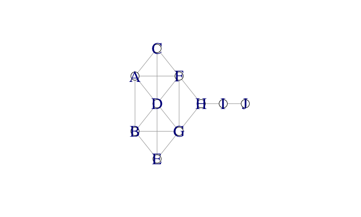 

## Components

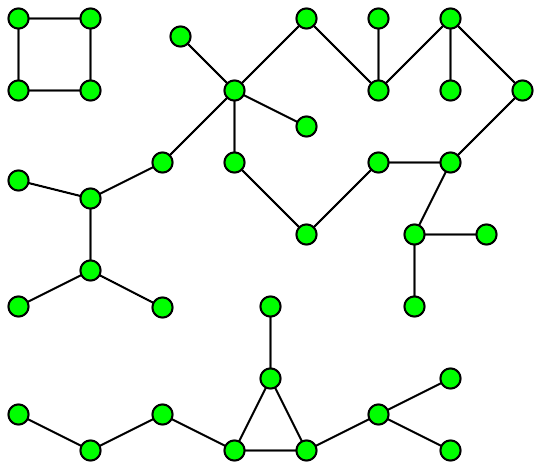

David Eppstein, public domain

## Strongly connected components

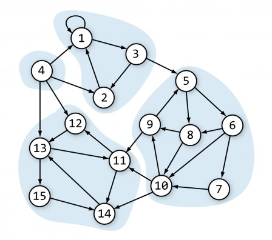

http://www.greatandlittle.com/studios/

----


```r
co <- components(air, mode = "weak")
co$csize
```

```
#> [1] 745   2   2   3   2   1
```

```r
groups(co)[[2]]
```

```
#> [1] "GKN" "MXY"
```

----


```r
co <- components(air, mode = "strong")
co$csize
```

```
#>  [1]   1   1   1   1   1   1   1   1   1   1   2   1   2   1   1   2   1
#> [18]   1   1   1   1   1   1   1 723   1   1   1   1   1
```

## Bow-tie structure of a directed graph

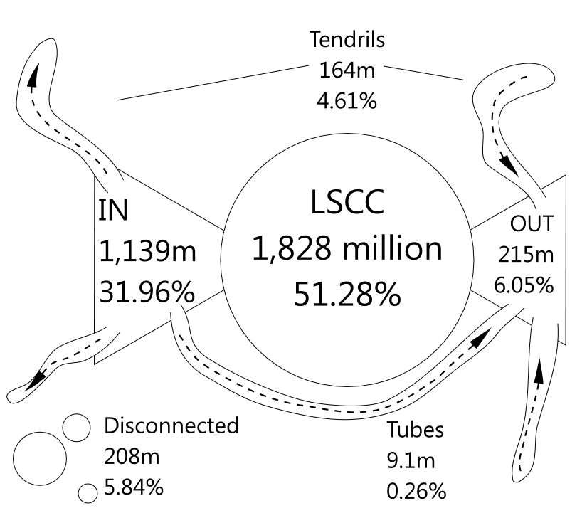

http://webdatacommons.org/hyperlinkgraph/2012-08/topology.html

## Exercise

1. Extract the large (strongly) connected component from the
   airport graph, as a separate graph.
   Hint: `components()`, `induced_subgraph()`.
   How many airports are not in this component?

1. In the large connected component, which airport is better
   connected, `LAX` or `BOS`? I.e. what is the mean number of
   plane changes that are required if traveling to a uniformly
   randomly picked airport?

1. Which airport is the best connected one? Which one is the 
   worst (within the strongly connected component)?

## Solution


```r
largest_component <- function(graph) {
  comps <- components(graph, mode = "strong")
  gr <- groups(comps)
  sizes <- vapply(gr, length, 1L)
  induced_subgraph(graph, gr[[ which.max(sizes) ]])
}
sc_air <- largest_component(air)
```

----


```r
table(distances(sc_air, "BOS"))
```

```
#> 
#>   0   1   2   3   4   5 
#>   1  83 355 135 147   2
```

```r
table(distances(sc_air, "LAX"))
```

```
#> 
#>   0   1   2   3   4   5 
#>   1 109 394 195  22   2
```

----


```r
mean(as.vector(distances(sc_air, "BOS")))
```

```
#> [1] 2.484094
```

```r
mean(as.vector(distances(sc_air, "LAX")))
```

```
#> [1] 2.185339
```

----


```r
D <- distances(sc_air)
sort(rowMeans(D))[1:10]
```

```
#>      ORD      MSP      SEA      DTW      LAX      PHX      EWR      ANC 
#> 2.117566 2.146611 2.149378 2.170124 2.185339 2.218534 2.224066 2.230982 
#>      SLC      JFK 
#> 2.235131 2.275242
```

----


```r
sort(rowMeans(D), decreasing = TRUE)[1:10]
```

```
#>      DQR      SDX      BLD      TIQ      TCL      CPX      AFK      WHD 
#> 6.147994 6.147994 5.150761 5.135546 4.889350 4.872752 4.820194 4.799447 
#>      ZXH      DOF 
#> 4.799447 4.798064
```

----


```r
V(sc_air)[[names(sort(rowMeans(D), decreasing = TRUE)[1:10])]]
```

```
#> + 10/723 vertices, named:
#>     name                 City         Position color
#> 567  DQR    Peach Springs, AZ N355919 W1134836  grey
#> 570  SDX           Sedona, AZ N345055 W1114718  grey
#> 566  BLD     Boulder City, NV N355651 W1145140  grey
#> 180  TIQ           Tinian, TT N145949 E1453705  grey
#> 688  TCL       Tuscaloosa, AL N331314 W0873641  grey
#> 722  CPX          Culebra, PR  N181848 W651816  grey
#> 670  AFK         Nebraska, NE  N403620 W955204  grey
#> 418  WHD            Hyder, AK N555412 W1300024  grey
#> 420  ZXH Chomondely Sound, AK N551421 W1320651  grey
#> 410  DOF         Dora Bay, AK N551400 W1321300  grey
```

## Centrality

Finding important vertices in the network (family of concepts)

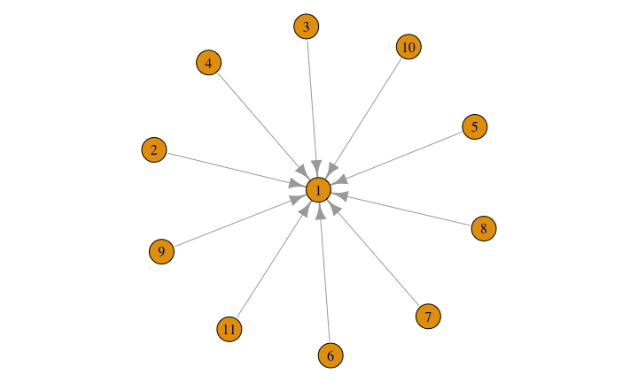 

## Centrality

 

## Classic centrality measures: degree


```r
V(kite)$label.cex <- 2
V(kite)$color <- V(kite)$frame.color <- "grey"
V(kite)$size <- 30
par(mar=c(0,0,0,0)) ; plot(kite)
```

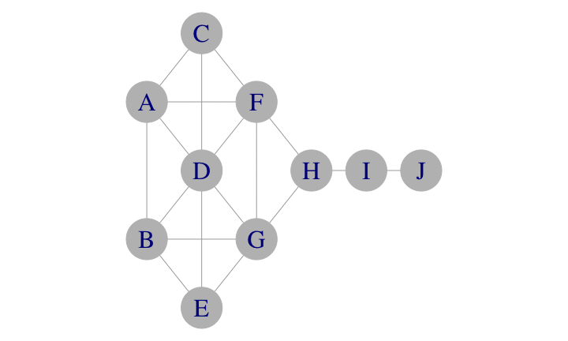 

-------


```r
d <- degree(kite)
par(mar = c(0,0,0,0))
plot(kite, vertex.size = 10 * d, vertex.label =
       paste0(V(kite)$name, ":", d))
```

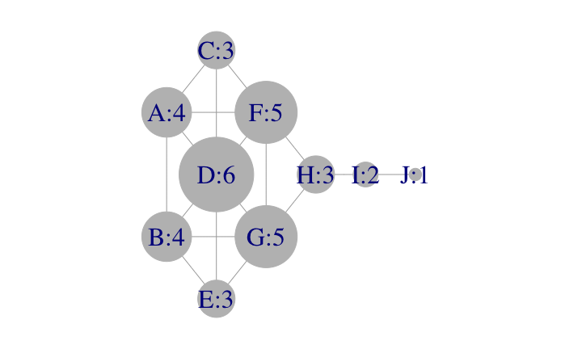 


## Classic centrality measures: closeness

1 / How many steps do you need to get there?


```r
cl <- closeness(kite)
```

-----


```r
par(mar=c(0,0,0,0)); plot(kite, vertex.size = 500 * cl)
```

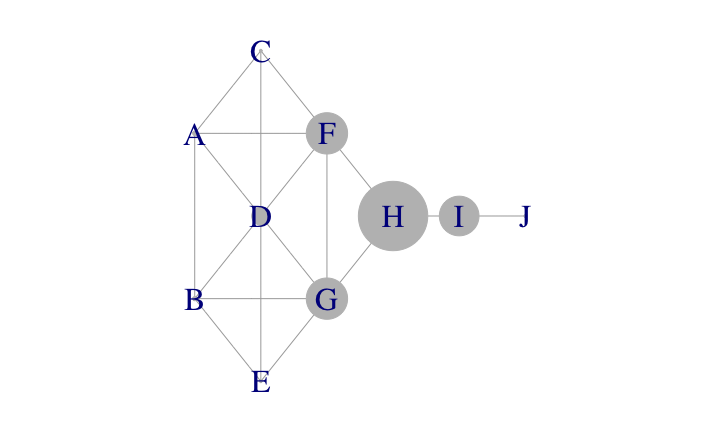 

## Classic centrality measures: betweenness

How many shortest paths goes through me


```r
btw <- betweenness(kite)
btw
```

```
#>          A          B          C          D          E          F 
#>  0.8333333  0.8333333  0.0000000  3.6666667  0.0000000  8.3333333 
#>          G          H          I          J 
#>  8.3333333 14.0000000  8.0000000  0.0000000
```

-----


```r
par(mar=c(0,0,0,0)); plot(kite, vertex.size = 3 * btw)
```

 

## Eigenvector centrality

Typically for directed. Central vertex: it is cited by central vertices.


```r
ec <- eigen_centrality(kite)$vector
ec
```

```
#>          A          B          C          D          E          F 
#> 0.73221232 0.73221232 0.59422577 1.00000000 0.59422577 0.82676381 
#>          G          H          I          J 
#> 0.82676381 0.40717690 0.09994054 0.02320742
```

```r
cor(ec, d)
```

```
#> [1] 0.9542561
```

-----


```r
par(mar=c(0,0,0,0)); plot(kite, vertex.size = 20 * ec)
```

 

## Page Rank

Fixes the practical problems with eigenvector centrality


```r
page_rank(kite)$vector
```

```
#>          A          B          C          D          E          F 
#> 0.10191991 0.10191991 0.07941811 0.14714792 0.07941811 0.12890693 
#>          G          H          I          J 
#> 0.12890693 0.09524829 0.08569396 0.05141993
```

## Exercise

Create a table that contains the top 10 most central 
airports according to all these centrality measures.

# Clusters

## Why finding groups

Finding groups in networks. Dimensionality reduction. Community detection.

We want to find dense groups.

-----

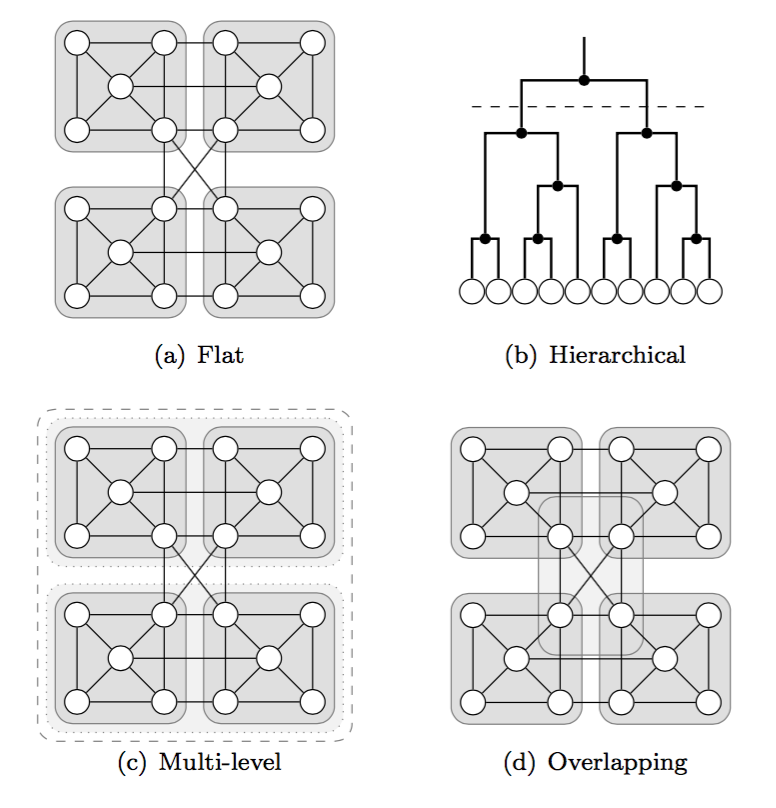

## Clusters by hand


```r
graph <- make_graph( ~ A-B-C-D-A, E-A:B:C:D, 
                       F-G-H-I-F, J-F:G:H:I,
                       K-L-M-N-K, O-K:L:M:N,
                       P-Q-R-S-P, T-P:Q:R:S,
                       B-F, E-J, C-I, L-T, O-T, M-S,
                       C-P, C-L, I-L, I-P)
```

----


```r
par(mar=c(0,0,0,0)); plot(graph)
```

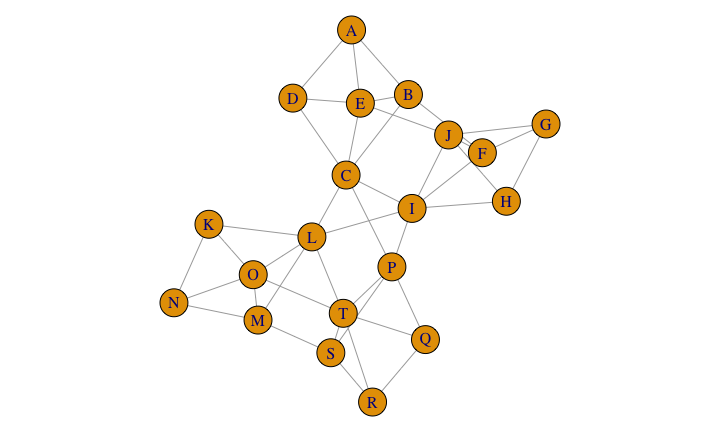 

----


```r
flat_clustering <- make_clusters(
    graph,
    c(1,1,1,1,1,2,2,2,2,2,3,3,3,3,3,4,4,4,4,4))
```

-----


```r
flat_clustering
```

```
#> IGRAPH clustering unknown, groups: 4, mod: 0.51
#> + groups:
#>   $`1`
#>   [1] 1 2 3 4 5
#>   
#>   $`2`
#>   [1]  6  7  8  9 10
#>   
#>   $`3`
#>   [1] 11 12 13 14 15
#>   
#>   $`4`
#>   + ... omitted several groups/vertices
```

-----


```r
flat_clustering[[1]]
```

```
#> [1] 1 2 3 4 5
```

```r
length(flat_clustering)
```

```
#> [1] 4
```

```r
sizes(flat_clustering)
```

```
#> Community sizes
#> 1 2 3 4 
#> 5 5 5 5
```

-----


```r
induced_subgraph(graph, flat_clustering[[1]])
```

```
#> IGRAPH UN-- 5 8 -- 
#> + attr: name (v/c)
#> + edges (vertex names):
#> [1] A--B A--D A--E B--C B--E C--D C--E D--E
```

## Hierarchical community structure

Typically produced by top-down or bottom-up clustering algorithms.

The outcome can be represented as a *dendrogram*,
a tree-like diagram that illustrates the order in which the clusters
are merged (in the bottom-up case) or split (in the top-down case).

-----

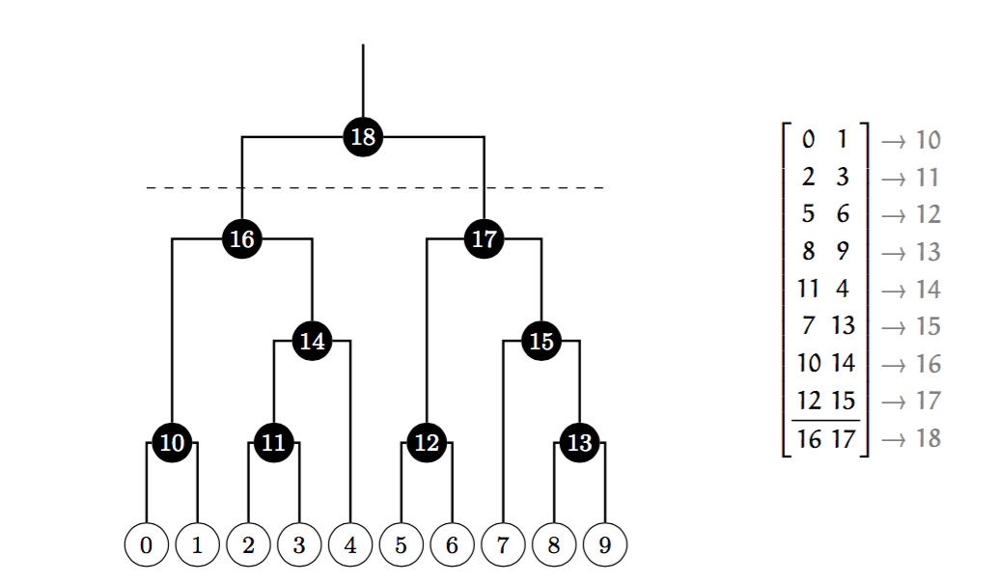

## Clustering quality measures

- External quality measures: require ground truth
- Internal quality measures: require assumption about *good*
clusters.

## External quality measures

Measure                       | Type       | Range      | igraph name
------------------------------|------------|------------|----------------
Rand index                    | similarity | 0 to 1     | `rand`
Adjusted Rand index           | similarity | -0.5 to 1  | `adjusted.rand`
Split-join distance           | distance   | 0 to 2n    | `split.join`
Variation of information      | distance   | 0 to log n | `vi` |
Normalized mutual information | similarity | 0 to 1     | `nmi`

## External quality measures


```r
data(karate)
karate
```

```
#> IGRAPH UNW- 34 78 -- Zachary's karate club network
#> + attr: name (g/c), Citation (g/c), Author (g/c), Faction (v/n),
#> | name (v/c), label (v/c), color (v/n), weight (e/n)
#> + edges (vertex names):
#>  [1] Mr Hi  --Actor 2  Mr Hi  --Actor 3  Mr Hi  --Actor 4 
#>  [4] Mr Hi  --Actor 5  Mr Hi  --Actor 6  Mr Hi  --Actor 7 
#>  [7] Mr Hi  --Actor 8  Mr Hi  --Actor 9  Mr Hi  --Actor 11
#> [10] Mr Hi  --Actor 12 Mr Hi  --Actor 13 Mr Hi  --Actor 14
#> [13] Mr Hi  --Actor 18 Mr Hi  --Actor 20 Mr Hi  --Actor 22
#> [16] Mr Hi  --Actor 32 Actor 2--Actor 3  Actor 2--Actor 4 
#> [19] Actor 2--Actor 8  Actor 2--Actor 14 Actor 2--Actor 18
#> + ... omitted several edges
```

```r
karate <- delete_edge_attr(karate, "weight")
```

-----


```r
ground_truth <- make_clusters(karate, V(karate)$Faction)
length(ground_truth)
```

```
#> [1] 2
```

```r
ground_truth
```

```
#> IGRAPH clustering unknown, groups: 2, mod: 0.37
#> + groups:
#>   $`1`
#>    [1]  1  2  3  4  5  6  7  8 11 12 13 14 17 18 20 22
#>   
#>   $`2`
#>    [1]  9 10 15 16 19 21 23 24 25 26 27 28 29 30 31 32 33 34
#> 
```

## Exercise

Write a naive clustering method that classifies vertices
into two groups, based on two center vertices. Put the two
centers in separate clusters, and other vertices in the
cluster whose center is closer to it.


```r
cluster_naive2 <- function(graph, center1, center2) {
  # ...
}
```

## Solution


```r
cluster_naive2 <- function(graph, center1, center2) {
  dist <- distances(graph, c(center1, center2))
  cl <- apply(dist, 2, which.min)
  make_clusters(graph, cl)
}
dist_memb <- cluster_naive2(karate, 'John A', 'Mr Hi')
```

----


```r
dist_memb
```

```
#> IGRAPH clustering unknown, groups: 2, mod: 0.31
#> + groups:
#>   $`1`
#>    [1] "Actor 9"  "Actor 10" "Actor 14" "Actor 15" "Actor 16" "Actor 19"
#>    [7] "Actor 20" "Actor 21" "Actor 23" "Actor 24" "Actor 25" "Actor 26"
#>   [13] "Actor 27" "Actor 28" "Actor 29" "Actor 30" "Actor 31" "Actor 32"
#>   [19] "Actor 33" "John A"  
#>   
#>   $`2`
#>    [1] "Mr Hi"    "Actor 2"  "Actor 3"  "Actor 4"  "Actor 5"  "Actor 6" 
#>    [7] "Actor 7"  "Actor 8"  "Actor 11" "Actor 12" "Actor 13" "Actor 17"
#>   [13] "Actor 18" "Actor 22"
#>   + ... omitted several groups/vertices
```

## Rand index

Check if pairs of vertices are classified correctly


```r
rand_index <- compare(ground_truth, dist_memb, method = "rand")
rand_index
```

```
#> [1] 0.885918
```

## Rand index

Random clusterings


```r
random_partition <- function(n, k = 2) { sample(k, n, replace = TRUE) }
total <- numeric(100)
for (i in seq_len(100)) {
  c1 <- random_partition(100)
  c2 <- random_partition(100)
  total[i] <- compare(c1, c2, method = "rand")
}
mean(total)
```

```
#> [1] 0.500198
```

## Adjusted Rand index


```r
total <- numeric(100)
for (i in seq_len(100)) {
  c1 <- random_partition(100)
  c2 <- random_partition(100)
  total[i] <- compare(c1, c2, method = "adjusted.rand")
}
mean(total)
```

```
#> [1] -0.001865032
```

## Adjusted rand index


```r
compare(ground_truth, dist_memb, method = "adjusted.rand")
```

```
#> [1] 0.7718469
```

## Internal quality metrics: density


```r
edge_density(karate)
```

```
#> [1] 0.1390374
```

```r
subgraph_density <- function(graph, vertices) {
  sg <- induced_subgraph(graph, vertices)
  edge_density(sg)
}
```


```r
subgraph_density(karate, ground_truth[[1]])
```

```
#> [1] 0.275
```

```r
subgraph_density(karate, ground_truth[[2]])
```

```
#> [1] 0.2287582
```

## Internal quality metrics: modularity

Uses a null model

$$Q(G) = \frac{1}{2m} \sum_{i=1}^n \sum_{j=1}^n \left( A_{ij} - p_{ij} \right) \delta_{ij}$$

$A_{ij}$: Adjacency matrix

$\delta_{ij}$: $i$ and $j$ are in the same cluster

$p_{ij}$ expected value for an $(i,j)$ edge from the null model

## Modularity

Common null model: degree-sequence (configuration) model

$$Q(G) = \frac{1}{2m} \sum_{i=1}^n \sum_{j=1}^n \left( A_{ij} - \frac{k_i k_j}{2m} \right)
       \delta_{ij}$$

## Modularity in igraph


```r
modularity(ground_truth)
```

```
#> [1] 0.3714661
```

```r
modularity(karate, membership(ground_truth))
```

```
#> [1] 0.3714661
```

----

Well behaving:


```r
modularity(karate, rep(1, gorder(karate)))
```

```
#> [1] 0
```

```r
modularity(karate, seq_len(gorder(karate)))
```

```
#> [1] -0.04980276
```

## Heuristic algorithms

Edge-betweenness clustering

Exact modularity optimization

Greedy agglomerative algorithm to maximize modularity

## Edge-betweenness clustering


```r
dendrogram <- cluster_edge_betweenness(karate)
dendrogram
```

```
#> IGRAPH clustering edge betweenness, groups: 5, mod: 0.4
#> + groups:
#>   $`1`
#>    [1] "Mr Hi"    "Actor 2"  "Actor 4"  "Actor 8"  "Actor 12" "Actor 13"
#>    [7] "Actor 14" "Actor 18" "Actor 20" "Actor 22"
#>   
#>   $`2`
#>   [1] "Actor 3"  "Actor 25" "Actor 26" "Actor 28" "Actor 29" "Actor 32"
#>   
#>   $`3`
#>   [1] "Actor 5"  "Actor 6"  "Actor 7"  "Actor 11" "Actor 17"
#>   
#>   + ... omitted several groups/vertices
```

-----


```r
membership(dendrogram)
```

```
#>    Mr Hi  Actor 2  Actor 3  Actor 4  Actor 5  Actor 6  Actor 7  Actor 8 
#>        1        1        2        1        3        3        3        1 
#>  Actor 9 Actor 10 Actor 11 Actor 12 Actor 13 Actor 14 Actor 15 Actor 16 
#>        4        5        3        1        1        1        4        4 
#> Actor 17 Actor 18 Actor 19 Actor 20 Actor 21 Actor 22 Actor 23 Actor 24 
#>        3        1        4        1        4        1        4        4 
#> Actor 25 Actor 26 Actor 27 Actor 28 Actor 29 Actor 30 Actor 31 Actor 32 
#>        2        2        4        2        2        4        4        2 
#> Actor 33   John A 
#>        4        4
```

-----


```r
compare_all <- function(cl1, cl2) {
  methods <- eval(as.list(args(compare))$method)
  vapply(methods, compare, 1.0, comm1 = cl1, comm2 = cl2)
}
compare_all(dendrogram, ground_truth)
```

```
#>            vi           nmi    split.join          rand adjusted.rand 
#>     0.8868344     0.5798278    13.0000000     0.7379679     0.4686165
```

-----


```r
cluster_memb <- cut_at(dendrogram, no = 2)
compare_all(cluster_memb, ground_truth)
```

```
#>            vi           nmi    split.join          rand adjusted.rand 
#>     0.2252446     0.8364981     2.0000000     0.9411765     0.8823025
```

```r
clustering <- make_clusters(karate, membership = cluster_memb)
```

----


```r
V(karate)[Faction == 1]$shape <- "circle"
V(karate)[Faction == 2]$shape <- "square"
par(mar=c(0,0,0,0)); plot(clustering, karate)
```

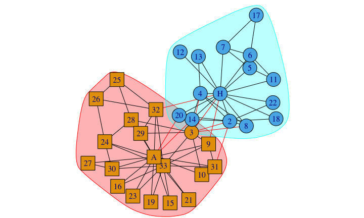 

-----


```r
par(mar=c(0,0,0,0)); plot_dendrogram(dendrogram, direction = "downwards")
```

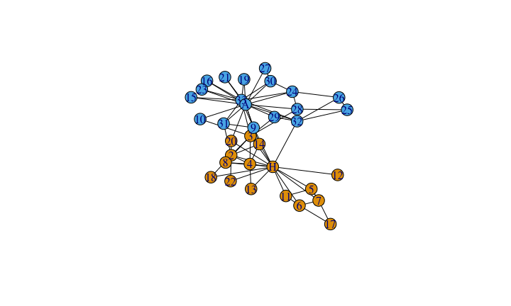 

## Exact modularity maximization


```r
optimal <- cluster_optimal(karate)
modularity(clustering)
```

```
#> [1] 0.3599606
```

```r
modularity(optimal)
```

```
#> [1] 0.4197896
```

```r
modularity(ground_truth)
```

```
#> [1] 0.3714661
```

## Heuristic modularity optimization


```r
dend_fast <- cluster_fast_greedy(karate)
compare_all(dend_fast, ground_truth)
```

```
#>            vi           nmi    split.join          rand adjusted.rand 
#>     0.5321150     0.6924673    10.0000000     0.8413547     0.6802559
```

-----


```r
par(mar = c(0,0,0,0)); plot_dendrogram(dend_fast, direction = "downwards")
```

 

# Visualization

## Plotting parameters

----

Globally


```r
igraph_options(edge.color = "black")
data(karate) ; par(mar=c(0,0,0,0)); plot(karate)
```

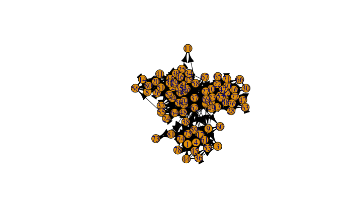 

-----

Graph parameter


```r
V(karate)$color <- "DarkOliveGreen" ; E(karate)$color <- "grey"
par(mar=c(0,0,0,0)) ; plot(karate)
```

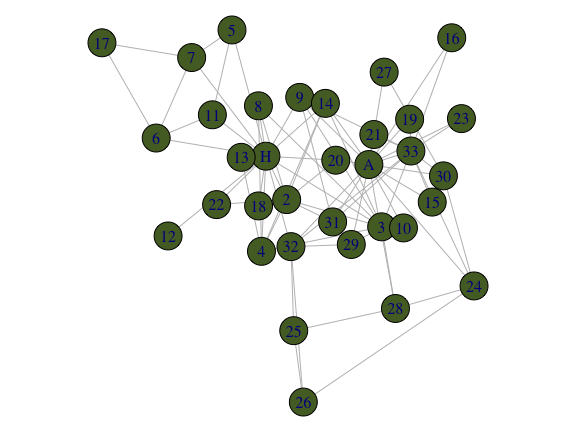 

-----

As an argument to `plot()`:

```r
par(mar = c(0,0,0,0))
plot(karate, edge.color = "black", vertex.color = "#00B7FF",
     vertex.label.color = "black")
```

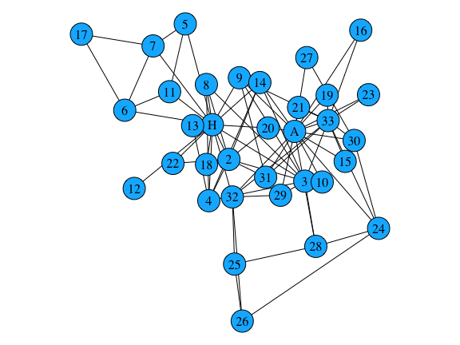 

## igraph color palettes


```r
karate$palette <- categorical_pal(length(clustering))
par(mar = c(0,0,0,0)); plot(karate, vertex.color = membership(clustering))
```

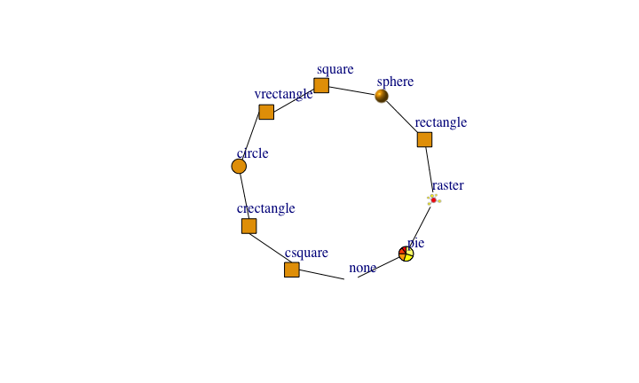 

----

Others: `r_pal()`, `sequential_pal()`, `diverging_pal()`.

## Graphical parameters

Vertices: `size`, `size`, `color`, `frame.color`, `shape` (circle, square, rectangle, pie, 
raster, none), `label`, `label.family`, `label.font`, `label.cex`, `label.dist`,
`label.degree`, `label.color`.

Edges: `color`, `width`, `arrow.size`, `arrow.width`, `lty`, `label`, 
`label.family`, `label.font`, `label.cex`, `label.color`, `label.x`, `label.y`,
`curved`, `arrow.mode`, `loop.angle`, `loop.angle2`.

Graph: `layout` (a numeric matrix), `margin`, `palette` (for vertex color),
`rescale`, `asp`, `frame`, `main` (title), `sub` (title), `xlab`, `ylab`.

## Vertex shapes


```r
shapes()
```

```
#>  [1] "circle"     "crectangle" "csquare"    "none"       "pie"       
#>  [6] "raster"     "rectangle"  "sphere"     "square"     "vrectangle"
```

----


```r
plot(g, vertex.shape=shapes, vertex.label=shapes, vertex.label.dist=1,
     vertex.size=15, vertex.size2=15,
     vertex.pie=lapply(shapes, function(x) if (x=="pie") 2:6 else 0),
     vertex.pie.color=list(heat.colors(5)))
```

----

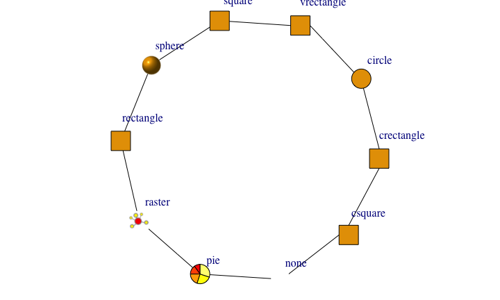 

## Layout algorithms

Layout lagorithm: place the vertices in a way, such that 

* nodes are distributed evenly
* edges have about the same length
* connected vertices are closer to each other
* edges are not crossing

This is really hard, often impossible!

## Force-directed algorithms

 

## Trees


```r
tree <- make_tree(20, 3)
par(mar = c(0,0,0,0)); plot(tree, layout=layout_as_tree)
```

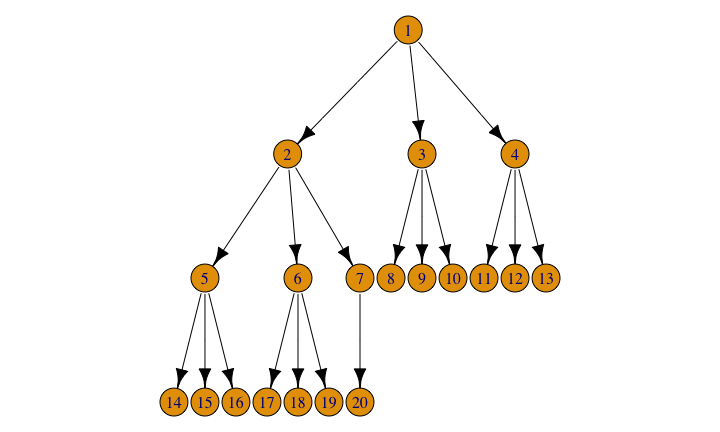 

----


```r
l <- layout_as_tree(tree, circular = TRUE)
par(mar = c(0,0,0,0)); plot(tree, layout = l)
```

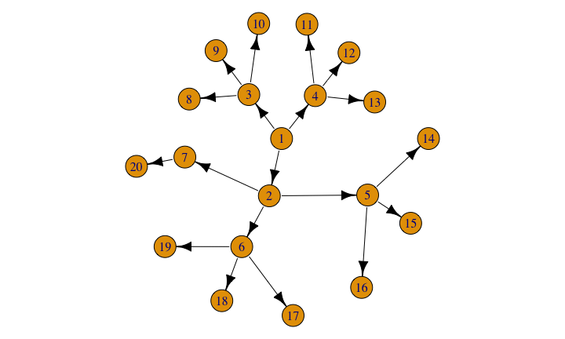 

----


```
#> [1] TRUE
```


```r
summary(DC)
```

```
#> IGRAPH DN-- 22 27 -- 
#> + attr: name (v/c), color (v/c), shape (v/c), size (v/n), size2
#> | (v/n), label (v/x), lty (e/n), arrow.size (e/n)
```

```r
lay1 <-  layout_with_sugiyama(DC, layers=apply(sapply(layers,
                        function(x) V(DC)$name %in% x), 1, which))
```

----


```r
par(mar = rep(0, 4))
plot(DC, layout = lay1$layout, vertex.label.cex = 0.5)
```

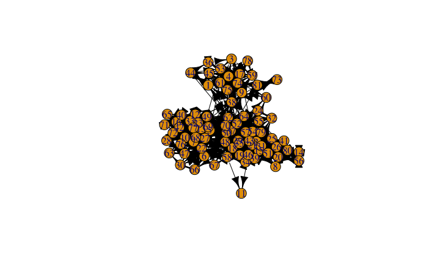 

----


```r
par(mar = c(0,0,0,0)); plot(lay1$extd_graph, vertex.label.cex=0.5)
```

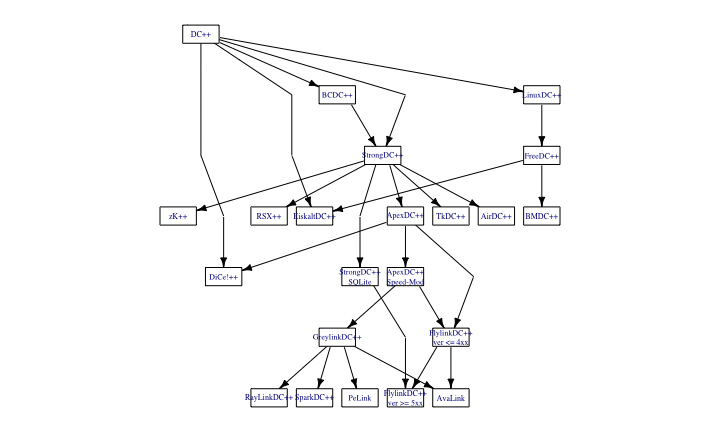 

## Slightly bigger networks


```r
data(UKfaculty)
UKfaculty
```

```
#> IGRAPH D-W- 81 817 -- 
#> + attr: Type (g/c), Date (g/c), Citation (g/c), Author (g/c),
#> | Group (v/n), weight (e/n)
#> + edges:
#>  [1] 57->52 76->42 12->69 43->34 28->47 58->51  7->29 40->71  5->37
#> [10] 48->55  6->58 21-> 8 28->69 43->21 67->58 65->42  5->67 52->75
#> [19] 37->64  4->36 12->49 19->46 37-> 9 74->36 62-> 1 15-> 2 72->49
#> [28] 46->62  2->29 40->12 22->29 71->69  4-> 3 37->69  5-> 6 77->13
#> [37] 23->49 52->35 20->14 62->70 34->35 76->72  7->42 37->42 51->80
#> [46] 38->45 62->64 36->53 62->77 17->61  7->68 46->29 44->53 18->58
#> [55] 12->16 72->42 52->32 58->21 38->17 15->51 22-> 7 22->69  5->13
#> + ... omitted several edges
```

----


```r
par(mar = c(0,0,0,0)); plot(UKfaculty, layout = layout_with_graphopt)
```

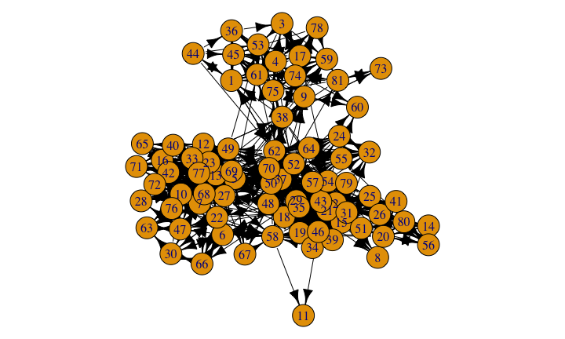 

----


```r
cl_uk <- cluster_louvain(as.undirected(UKfaculty))
cl_gr <- contract(UKfaculty, mapping = cl_uk$membership)
E(cl_gr)$weight <- count_multiple(cl_gr)
cl_grs <- simplify(cl_gr)
E(cl_grs)$weight
```

```
#>  [1]  289    1   49  256  289 1296   16  256  144   16    4  729  784
#> [14]  256    1   81  121  169
```

----


```r
par(mar = c(0,0,0,0)); plot(cl_grs, edge.width=E(cl_grs)$weight / 200,
            edge.curved = .2, vertex.size = sizes(cl_uk) * 2)
```

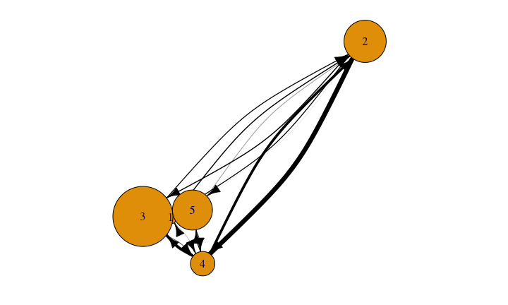 

----


```r
subs <- lapply(groups(cl_uk), induced_subgraph, graph = UKfaculty)
summary(subs[[1]])
```

```
#> IGRAPH D-W- 6 29 -- 
#> + attr: Type (g/c), Date (g/c), Citation (g/c), Author (g/c),
#> | Group (v/n), weight (e/n)
```

----


```r
par(mar=c(0,0,0,0)); plot(subs[[1]])
```

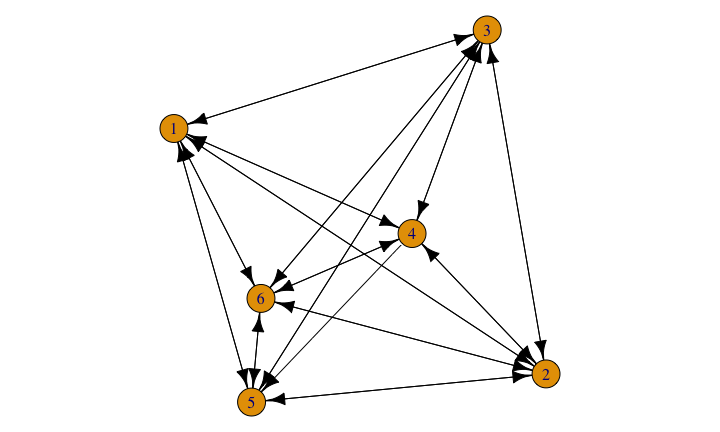 

## Exercise

A minimum spanning tree is a graph without cycle, that has the minimal 
weight sum among all spanning trees of the graph.

Try to visualize the airport network using the minimal spanning tree.
`mst()` calculates the (or a) minimum spanning tree. Hint: what will
you use as weight? Do you really want a minimum spanning tree, or a 
maximum spanning tree?

## Exporting and importing graphs

`read_graph()` and `write_graph()`.

Imports: edge list, Pajek, GraphML, GML, DL, ...

Exports: edge list, Pajek, GraphML, GML, DOT, Leda, ...

Helpful packages: `rgexf`, `intergraph`, `DiagrammeR`, `networkD3`.

## The `networkD3` package


```r
library(networkD3)
d3_net <- simpleNetwork(as_data_frame(karate, what = "edges")[, 1:3])
d3_net
```

<!--html_preserve--><div id="htmlwidget-6285" style="width:720px;height:432px;" class="simpleNetwork"></div>
<script type="application/json" data-for="htmlwidget-6285">{"x":{"links":{"source":["Mr Hi","Mr Hi","Mr Hi","Mr Hi","Mr Hi","Mr Hi","Mr Hi","Mr Hi","Mr Hi","Mr Hi","Mr Hi","Mr Hi","Mr Hi","Mr Hi","Mr Hi","Mr Hi","Actor 2","Actor 2","Actor 2","Actor 2","Actor 2","Actor 2","Actor 2","Actor 2","Actor 3","Actor 3","Actor 3","Actor 3","Actor 3","Actor 3","Actor 3","Actor 3","Actor 4","Actor 4","Actor 4","Actor 5","Actor 5","Actor 6","Actor 6","Actor 6","Actor 7","Actor 9","Actor 9","Actor 9","Actor 10","Actor 14","Actor 15","Actor 15","Actor 16","Actor 16","Actor 19","Actor 19","Actor 20","Actor 21","Actor 21","Actor 23","Actor 23","Actor 24","Actor 24","Actor 24","Actor 24","Actor 24","Actor 25","Actor 25","Actor 25","Actor 26","Actor 27","Actor 27","Actor 28","Actor 29","Actor 29","Actor 30","Actor 30","Actor 31","Actor 31","Actor 32","Actor 32","Actor 33"],"target":["Actor 2","Actor 3","Actor 4","Actor 5","Actor 6","Actor 7","Actor 8","Actor 9","Actor 11","Actor 12","Actor 13","Actor 14","Actor 18","Actor 20","Actor 22","Actor 32","Actor 3","Actor 4","Actor 8","Actor 14","Actor 18","Actor 20","Actor 22","Actor 31","Actor 4","Actor 8","Actor 9","Actor 10","Actor 14","Actor 28","Actor 29","Actor 33","Actor 8","Actor 13","Actor 14","Actor 7","Actor 11","Actor 7","Actor 11","Actor 17","Actor 17","Actor 31","Actor 33","John A","John A","John A","Actor 33","John A","Actor 33","John A","Actor 33","John A","John A","Actor 33","John A","Actor 33","John A","Actor 26","Actor 28","Actor 30","Actor 33","John A","Actor 26","Actor 28","Actor 32","Actor 32","Actor 30","John A","John A","Actor 32","John A","Actor 33","John A","Actor 33","John A","Actor 33","John A","John A"]},"options":{"linkDistance":50,"charge":-200,"fontSize":7,"linkColour":"#666","nodeColour":"#3182bd","nodeClickColour":"#E34A33","textColour":"#3182bd","opacity":0.6,"zoom":false}},"evals":[]}</script><!--/html_preserve-->

## The `DiagrammeR` package


```r
library(DiagrammeR)
```

```
#> 
#> Attaching package: 'DiagrammeR'
#> 
#> The following object is masked from 'package:igraph':
#> 
#>     add_edges
```

----


```r
df_kar <- as_data_frame(karate, what = "both")
df_kar$vertices <- cbind(node = rownames(df_kar$vertices),
                         df_kar$vertices)
dg <- create_graph(
  nodes_df = df_kar$vertices,
  edges_df = df_kar$edges
)
render_graph(dg, width = 800, height = 600)
```

<!--html_preserve--><div id="htmlwidget-9796" style="width:800px;height:600px;" class="grViz"></div>
<script type="application/json" data-for="htmlwidget-9796">{"x":{"diagram":"digraph {\n\n  \"Mr Hi\" [label = \"H\", color = \"DarkOliveGreen\"] \n  \"Actor 2\" [label = \"2\", color = \"DarkOliveGreen\"] \n  \"Actor 3\" [label = \"3\", color = \"DarkOliveGreen\"] \n  \"Actor 4\" [label = \"4\", color = \"DarkOliveGreen\"] \n  \"Actor 5\" [label = \"5\", color = \"DarkOliveGreen\"] \n  \"Actor 6\" [label = \"6\", color = \"DarkOliveGreen\"] \n  \"Actor 7\" [label = \"7\", color = \"DarkOliveGreen\"] \n  \"Actor 8\" [label = \"8\", color = \"DarkOliveGreen\"] \n  \"Actor 9\" [label = \"9\", color = \"DarkOliveGreen\"] \n  \"Actor 10\" [label = \"10\", color = \"DarkOliveGreen\"] \n  \"Actor 11\" [label = \"11\", color = \"DarkOliveGreen\"] \n  \"Actor 12\" [label = \"12\", color = \"DarkOliveGreen\"] \n  \"Actor 13\" [label = \"13\", color = \"DarkOliveGreen\"] \n  \"Actor 14\" [label = \"14\", color = \"DarkOliveGreen\"] \n  \"Actor 15\" [label = \"15\", color = \"DarkOliveGreen\"] \n  \"Actor 16\" [label = \"16\", color = \"DarkOliveGreen\"] \n  \"Actor 17\" [label = \"17\", color = \"DarkOliveGreen\"] \n  \"Actor 18\" [label = \"18\", color = \"DarkOliveGreen\"] \n  \"Actor 19\" [label = \"19\", color = \"DarkOliveGreen\"] \n  \"Actor 20\" [label = \"20\", color = \"DarkOliveGreen\"] \n  \"Actor 21\" [label = \"21\", color = \"DarkOliveGreen\"] \n  \"Actor 22\" [label = \"22\", color = \"DarkOliveGreen\"] \n  \"Actor 23\" [label = \"23\", color = \"DarkOliveGreen\"] \n  \"Actor 24\" [label = \"24\", color = \"DarkOliveGreen\"] \n  \"Actor 25\" [label = \"25\", color = \"DarkOliveGreen\"] \n  \"Actor 26\" [label = \"26\", color = \"DarkOliveGreen\"] \n  \"Actor 27\" [label = \"27\", color = \"DarkOliveGreen\"] \n  \"Actor 28\" [label = \"28\", color = \"DarkOliveGreen\"] \n  \"Actor 29\" [label = \"29\", color = \"DarkOliveGreen\"] \n  \"Actor 30\" [label = \"30\", color = \"DarkOliveGreen\"] \n  \"Actor 31\" [label = \"31\", color = \"DarkOliveGreen\"] \n  \"Actor 32\" [label = \"32\", color = \"DarkOliveGreen\"] \n  \"Actor 33\" [label = \"33\", color = \"DarkOliveGreen\"] \n  \"John A\" [label = \"A\", color = \"DarkOliveGreen\"] \n\"Mr Hi\"->\"Actor 2\" [weight = \"4\", color = \"grey\"] \n\"Mr Hi\"->\"Actor 3\" [weight = \"5\", color = \"grey\"] \n\"Mr Hi\"->\"Actor 4\" [weight = \"3\", color = \"grey\"] \n\"Mr Hi\"->\"Actor 5\" [weight = \"3\", color = \"grey\"] \n\"Mr Hi\"->\"Actor 6\" [weight = \"3\", color = \"grey\"] \n\"Mr Hi\"->\"Actor 7\" [weight = \"3\", color = \"grey\"] \n\"Mr Hi\"->\"Actor 8\" [weight = \"2\", color = \"grey\"] \n\"Mr Hi\"->\"Actor 9\" [weight = \"2\", color = \"grey\"] \n\"Mr Hi\"->\"Actor 11\" [weight = \"2\", color = \"grey\"] \n\"Mr Hi\"->\"Actor 12\" [weight = \"3\", color = \"grey\"] \n\"Mr Hi\"->\"Actor 13\" [weight = \"1\", color = \"grey\"] \n\"Mr Hi\"->\"Actor 14\" [weight = \"3\", color = \"grey\"] \n\"Mr Hi\"->\"Actor 18\" [weight = \"2\", color = \"grey\"] \n\"Mr Hi\"->\"Actor 20\" [weight = \"2\", color = \"grey\"] \n\"Mr Hi\"->\"Actor 22\" [weight = \"2\", color = \"grey\"] \n\"Mr Hi\"->\"Actor 32\" [weight = \"2\", color = \"grey\"] \n\"Actor 2\"->\"Actor 3\" [weight = \"6\", color = \"grey\"] \n\"Actor 2\"->\"Actor 4\" [weight = \"3\", color = \"grey\"] \n\"Actor 2\"->\"Actor 8\" [weight = \"4\", color = \"grey\"] \n\"Actor 2\"->\"Actor 14\" [weight = \"5\", color = \"grey\"] \n\"Actor 2\"->\"Actor 18\" [weight = \"1\", color = \"grey\"] \n\"Actor 2\"->\"Actor 20\" [weight = \"2\", color = \"grey\"] \n\"Actor 2\"->\"Actor 22\" [weight = \"2\", color = \"grey\"] \n\"Actor 2\"->\"Actor 31\" [weight = \"2\", color = \"grey\"] \n\"Actor 3\"->\"Actor 4\" [weight = \"3\", color = \"grey\"] \n\"Actor 3\"->\"Actor 8\" [weight = \"4\", color = \"grey\"] \n\"Actor 3\"->\"Actor 9\" [weight = \"5\", color = \"grey\"] \n\"Actor 3\"->\"Actor 10\" [weight = \"1\", color = \"grey\"] \n\"Actor 3\"->\"Actor 14\" [weight = \"3\", color = \"grey\"] \n\"Actor 3\"->\"Actor 28\" [weight = \"2\", color = \"grey\"] \n\"Actor 3\"->\"Actor 29\" [weight = \"2\", color = \"grey\"] \n\"Actor 3\"->\"Actor 33\" [weight = \"2\", color = \"grey\"] \n\"Actor 4\"->\"Actor 8\" [weight = \"3\", color = \"grey\"] \n\"Actor 4\"->\"Actor 13\" [weight = \"3\", color = \"grey\"] \n\"Actor 4\"->\"Actor 14\" [weight = \"3\", color = \"grey\"] \n\"Actor 5\"->\"Actor 7\" [weight = \"2\", color = \"grey\"] \n\"Actor 5\"->\"Actor 11\" [weight = \"3\", color = \"grey\"] \n\"Actor 6\"->\"Actor 7\" [weight = \"5\", color = \"grey\"] \n\"Actor 6\"->\"Actor 11\" [weight = \"3\", color = \"grey\"] \n\"Actor 6\"->\"Actor 17\" [weight = \"3\", color = \"grey\"] \n\"Actor 7\"->\"Actor 17\" [weight = \"3\", color = \"grey\"] \n\"Actor 9\"->\"Actor 31\" [weight = \"3\", color = \"grey\"] \n\"Actor 9\"->\"Actor 33\" [weight = \"3\", color = \"grey\"] \n\"Actor 9\"->\"John A\" [weight = \"4\", color = \"grey\"] \n\"Actor 10\"->\"John A\" [weight = \"2\", color = \"grey\"] \n\"Actor 14\"->\"John A\" [weight = \"3\", color = \"grey\"] \n\"Actor 15\"->\"Actor 33\" [weight = \"3\", color = \"grey\"] \n\"Actor 15\"->\"John A\" [weight = \"2\", color = \"grey\"] \n\"Actor 16\"->\"Actor 33\" [weight = \"3\", color = \"grey\"] \n\"Actor 16\"->\"John A\" [weight = \"4\", color = \"grey\"] \n\"Actor 19\"->\"Actor 33\" [weight = \"1\", color = \"grey\"] \n\"Actor 19\"->\"John A\" [weight = \"2\", color = \"grey\"] \n\"Actor 20\"->\"John A\" [weight = \"1\", color = \"grey\"] \n\"Actor 21\"->\"Actor 33\" [weight = \"3\", color = \"grey\"] \n\"Actor 21\"->\"John A\" [weight = \"1\", color = \"grey\"] \n\"Actor 23\"->\"Actor 33\" [weight = \"2\", color = \"grey\"] \n\"Actor 23\"->\"John A\" [weight = \"3\", color = \"grey\"] \n\"Actor 24\"->\"Actor 26\" [weight = \"5\", color = \"grey\"] \n\"Actor 24\"->\"Actor 28\" [weight = \"4\", color = \"grey\"] \n\"Actor 24\"->\"Actor 30\" [weight = \"3\", color = \"grey\"] \n\"Actor 24\"->\"Actor 33\" [weight = \"5\", color = \"grey\"] \n\"Actor 24\"->\"John A\" [weight = \"4\", color = \"grey\"] \n\"Actor 25\"->\"Actor 26\" [weight = \"2\", color = \"grey\"] \n\"Actor 25\"->\"Actor 28\" [weight = \"3\", color = \"grey\"] \n\"Actor 25\"->\"Actor 32\" [weight = \"2\", color = \"grey\"] \n\"Actor 26\"->\"Actor 32\" [weight = \"7\", color = \"grey\"] \n\"Actor 27\"->\"Actor 30\" [weight = \"4\", color = \"grey\"] \n\"Actor 27\"->\"John A\" [weight = \"2\", color = \"grey\"] \n\"Actor 28\"->\"John A\" [weight = \"4\", color = \"grey\"] \n\"Actor 29\"->\"Actor 32\" [weight = \"2\", color = \"grey\"] \n\"Actor 29\"->\"John A\" [weight = \"2\", color = \"grey\"] \n\"Actor 30\"->\"Actor 33\" [weight = \"4\", color = \"grey\"] \n\"Actor 30\"->\"John A\" [weight = \"2\", color = \"grey\"] \n\"Actor 31\"->\"Actor 33\" [weight = \"3\", color = \"grey\"] \n\"Actor 31\"->\"John A\" [weight = \"3\", color = \"grey\"] \n\"Actor 32\"->\"Actor 33\" [weight = \"4\", color = \"grey\"] \n\"Actor 32\"->\"John A\" [weight = \"4\", color = \"grey\"] \n\"Actor 33\"->\"John A\" [weight = \"5\", color = \"grey\"] \n}","config":{"engine":"dot","options":null}},"evals":[]}</script><!--/html_preserve-->

## How to export to Gephi


```r
library(rgexf)
```

```
#> Loading required package: XML
#> Loading required package: Rook
```

```r
df_fac <- as_data_frame(UKfaculty, what = "both")
df_fac$vertices <- cbind(seq_len(gorder(UKfaculty)), df_fac$vertices)
output <- "images/UKfaculty.gexf"
write.gexf(nodes = df_fac$vertices, edges = df_fac$edges[,1:2], 
           edgesAtt = df_fac$edges[,-(1:2), drop = FALSE],
           output = output)
```

```
#> GEXF graph successfully written at:
#> /Users/gaborcsardi/works/igraph/netuser15/images/UKfaculty.gexf
```

## A network viz tutorial 

Highly recommended:

https://github.com/kateto/R-Network-Visualization-Workshop

## Questions?

Ask a question:

http://igraph.org/r/#help

Report a bug:

http://igraph.org/r/#contribute
